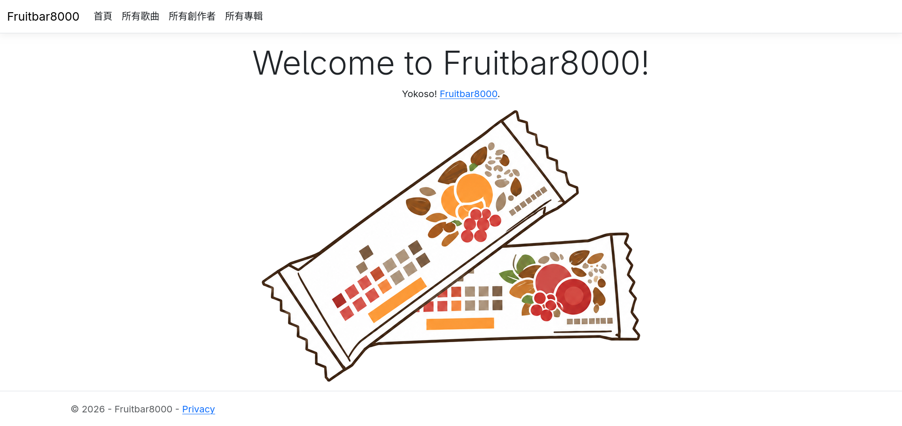
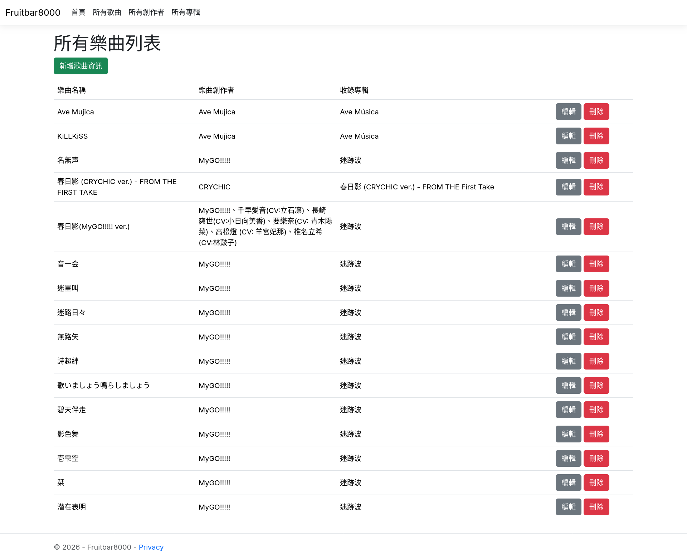
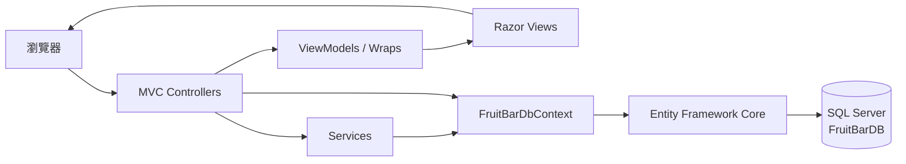
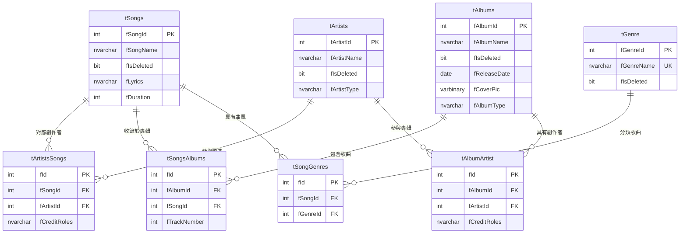

# Fruitbar8000

Fruitbar8000 是以歌曲為核心的音樂資料管理網站，使用 ASP.NET Core MVC 與 Entity Framework Core 建置。專案目前提供歌曲、創作者與專輯的基本資料維護，並透過關聯表管理一首歌曲對應多位創作者及多張專輯的情境。



## 主要功能

- 瀏覽、新增、編輯與刪除歌曲。
- 瀏覽、新增、編輯與刪除創作者及專輯。
- 編輯歌曲與多位創作者、多張專輯之間的關聯。
- 刪除歌曲時一併移除歌曲與創作者、專輯的關聯資料。
- 防止刪除仍有歌曲關聯的創作者或專輯。



## 使用技術

| 類別 | 技術 |
| --- | --- |
| 執行環境 | .NET 10 |
| Web 框架 | ASP.NET Core MVC、Razor Views |
| 資料存取 | Entity Framework Core 10、SQL Server Provider |
| 資料庫 | Microsoft SQL Server |
| 前端 | Bootstrap、jQuery、jQuery Validation |

## 功能與系統架構

應用程式採用 ASP.NET Core MVC。瀏覽器請求由 Controller 接收，Controller 使用 ViewModel／Wrap 組合畫面資料，並透過服務與 `FruitBarDbContext` 存取 SQL Server。



主要功能分工如下：

- `GalleryController`：歌曲清單、歌曲 CRUD，以及歌曲與創作者／專輯的關聯維護。
- `ArtistsController`：創作者資料 CRUD。
- `AlbumsController`：專輯資料 CRUD。
- `GalleryDataAccess`：抽取以下操作邏輯：歌曲畫面資料組合、關聯同步、刪除及曲序配置。
- `CheckNavigate`：抽取以下操作邏輯：刪除創作者或專輯前檢查是否仍有歌曲關聯。

### 資料模型

資料庫名稱為 `FruitBarDB`，應用程式資料表位於 `Fruitbar` schema。歌曲、創作者、專輯及曲風以中介表建立多對多關聯。



## 專案結構

```text
Fruitbar8000WebCore/
├── slnFruitbar8000WebCore.slnx
└── prjFruitbar8000WebCore/
    ├── Controllers/       # MVC 請求處理與頁面流程
    ├── Models/
    │   ├── Entities/      # EF Core 資料庫實體
    │   ├── Services/      # 資料查詢與關聯操作邏輯
    │   ├── ViewModels/    # 歌曲頁面的顯示與表單模型
    │   └── Wraps/         # 創作者、專輯的畫面包裝模型
    ├── Views/             # Razor 頁面
    ├── dbscripts/         # SQL Server 資料庫建立腳本
    ├── wwwroot/           # CSS、JavaScript 與前端套件
    ├── Program.cs         # 服務註冊與 HTTP pipeline
    └── appsettings.json   # 應用程式設定與連線字串鍵名
```

## 建置開發環境

### 1. 前置需求

- [.NET 10 SDK](https://dotnet.microsoft.com/download/dotnet/10.0)
- Microsoft SQL Server，且執行個體須支援資料庫相容性層級 170
- 下列其中一項 SQL 操作工具：
  - SQL Server Management Studio（SSMS）
  - `sqlcmd`
- Git

可先確認 .NET SDK：

```bash
dotnet --version
```

### 2. 取得原始碼並建置

以下命令皆從儲存庫根目錄執行：

```bash
git clone https://github.com/reboot0707/Fruitbar8000WebCore.git
cd Fruitbar8000WebCore
dotnet restore slnFruitbar8000WebCore.slnx
dotnet build slnFruitbar8000WebCore.slnx
```

### 3. 建立資料庫

資料庫建立腳本位於：

```text
prjFruitbar8000WebCore/dbscripts/FruitBarDB.sql
```

腳本會建立：

- `FruitBarDB` 資料庫與 `Fruitbar` schema。
- 歌曲、創作者、專輯、曲風及其關聯表。
- 主鍵、唯一索引、外鍵、預設值與曲序檢查約束。

執行帳號必須具有建立資料庫及相關物件的權限。此腳本是一次性資料庫建立腳本，不具冪等性；也就是說，若 `FruitBarDB` 已存在，請勿直接重複執行。腳本只建立資料庫結構，不包含種子資料（已可藉由系統介面建檔）。

#### 使用 Database Client（如：SSMS）

1. 以具備資料庫建立權限的帳號連線至 SQL Server。
2. 開啟 `prjFruitbar8000WebCore/dbscripts/FruitBarDB.sql`。
3. 執行整份腳本。
4. 確認已建立 `FruitBarDB`，且其中包含 `Fruitbar` schema 與相關資料表。

#### 使用 sqlcmd

使用 Windows／整合式驗證時：

```bash
sqlcmd -S <伺服器位址> -E -C -i "./prjFruitbar8000WebCore/dbscripts/FruitBarDB.sql"
```

使用 SQL Server 帳號驗證時：

```bash
sqlcmd -S <伺服器位址> -U <帳號> -P <密碼> -C -i "./prjFruitbar8000WebCore/dbscripts/FruitBarDB.sql"
```

請依環境替換角括號內容。避免將實際密碼寫入 README、Git 追蹤檔案或可共享的指令紀錄。

### 4. 設定資料庫連線

專案已啟用 .NET User Secrets。建議開發階段將連線字串存放於 User Secrets，不要直接寫入 `appsettings.json`。部署階段慎選服務商，須留意這類資訊放到環境變數也有因雲端服務提供者遭入侵而外洩的[風險](https://www.ithome.com.tw/news/178534)。

Windows 整合式驗證範例：

```bash
dotnet user-secrets set "ConnectionStrings:FruitBarDbContext" "Server=<伺服器位址>;Database=FruitBarDB;Trusted_Connection=True;TrustServerCertificate=True" --project ./prjFruitbar8000WebCore/prjFruitbar8000WebCore.csproj
```

SQL Server 帳號驗證範例：

```bash
dotnet user-secrets set "ConnectionStrings:FruitBarDbContext" "Server=<伺服器位址>;Database=FruitBarDB;User Id=<帳號>;Password=<密碼>;TrustServerCertificate=True" --project ./prjFruitbar8000WebCore/prjFruitbar8000WebCore.csproj
```

確認已設定的鍵值：

```bash
dotnet user-secrets list --project ./prjFruitbar8000WebCore/prjFruitbar8000WebCore.csproj
```

`dotnet user-secrets list` 會顯示秘密內容，請勿在共享畫面、記錄或 CI 輸出中執行。

### 5. 啟動網站

```bash
dotnet run --project ./prjFruitbar8000WebCore/prjFruitbar8000WebCore.csproj
```

預設開發網址：

- HTTPS：<https://localhost:7092>
- HTTP：<http://localhost:5226>

如本機尚未信任 ASP.NET Core 開發憑證，可執行：

```bash
dotnet dev-certs https --trust
```

## 主要頁面

| 功能 | 路由 |
| --- | --- |
| 首頁 | `/` 或 `/Home/Index` |
| 歌曲清單 | `/Gallery/List` |
| 新增歌曲 | `/Gallery/Create` |
| 創作者管理 | `/Artists` |
| 專輯管理 | `/Albums` |

首次啟動時資料庫沒有初始資料。建議先新增創作者與專輯，再新增歌曲並選取其關聯資料。

## 常用開發指令

```bash
# 還原 NuGet 套件
dotnet restore slnFruitbar8000WebCore.slnx

# 建置整個方案
dotnet build slnFruitbar8000WebCore.slnx

# 啟動網站
dotnet run --project ./prjFruitbar8000WebCore/prjFruitbar8000WebCore.csproj

# 監看檔案變更並自動重新啟動
dotnet watch --project ./prjFruitbar8000WebCore/prjFruitbar8000WebCore.csproj run
```

## 其他事項

- 資料庫版本以 `dbscripts/FruitBarDB.sql` 為準。
- 歌曲新增與編輯目前要求至少選取一位創作者及一張專輯。
- 現行專輯曲序由應用程式自動配置；同一專輯內的曲序及歌曲關聯受資料庫唯一索引保護。
